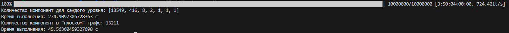

# Лабораторная работа
## 6 баллов

Алгоритм поиска компонент связности графа HNSW был реализован в 2 вариантах. Первый - воспринимает каждый слой как независимый граф и ищет компоненты связности во всех слоях. Второй - учитывает всевозможные связи вершин на всех уровнях и ищет компоненты связности в "плоском" графе.

Реализован тест на графе вида:

В нём на нижнем уровне присутствуют 2 компоненты связности - вершины [1, 2, 3] и [4, 5, 6]. На верхнем уровне присутствуют вершины 1 и 5, также составляющие компоненту.
То есть, в "плоском" графе будет присутствовать всего одна компонента связности, так как разные компоненты нижнего уровня соединены через верхний. Результат выполнение прогарммы:

Результат выполнения на графе, содержащим 1 миллион векторов из base.10M датасета с параметрами m=16, m0=32, ef_construction=10:

Результат выполнения на полном графе, содержащим 10 миллион векторов из base.10M датасета с параметрами m=16, m0=32, ef_construction=10:

## 8 баллов

