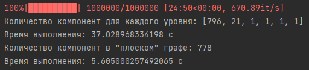

# Лабораторная работа
## 6 баллов

Алгоритм поиска компонент связности графа HNSW был реализован в 2 вариантах. Первый - воспринимает каждый слой как независимый граф и ищет компоненты связности во всех слоях. Второй - учитывает всевозможные связи вершин на всех уровнях и ищет компоненты связности в "плоском" графе.

Реализован тест на графе вида:
  
В нём на нижнем уровне присутствуют 2 компоненты связности - вершины [1, 2, 3] и [4, 5, 6]. На верхнем уровне присутствуют вершины 1 и 5, также составляющие компоненту.
То есть, в "плоском" графе будет присутствовать всего одна компонента связности, 
так как разные компоненты нижнего уровня соединены через верхний. 
Результат выполнение прогарммы (файл test_small_graphs.py):  
  
  
Результат выполнения на графе, содержащим 1 миллион векторов из base.10M датасета с параметрами m=16, m0=32:  
  
Результат выполнения на полном графе, содержащим 10 миллионов векторов из base.10M датасета с параметрами m=16, m0=32:  

## 8 баллов

В качестве улучшения графа была предложена модификация получения окресности.
Если в базовой версии, при нахождении недостаточного количества соседей эвристикой, 
они дополнялись до нужного количества жадным выбором из оставшихся, то сейчас эвристика 
запускается по новой среди не выбранных кандидатов. Количетсво таких рекурсивных 
вызовов ограничено 3-мя. Таким образом мы создаём более равномерную окресность с 
вершинами с разных "сторон" от целевой точки.  
  
Таким образом получилось добится улучшения по recall, а также уменьшения количества вызовов функции 
при поиске со значениями параметра ef < 13. В дальнейшем кол-во вызовов превышает базовый результат.  
  
  

Эксперименты с увеличением количества слоёв практически не влияли на результат. 
Уменьшение количества рекурсивных вызовов ухудшало recall при малых значениях ef.
